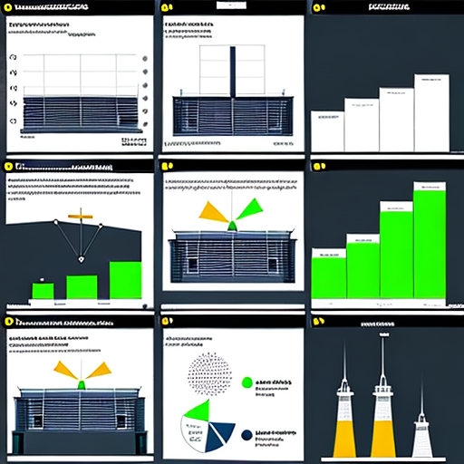

# Advertisements Assessment

  

This project aims to develop an ML pipeline using YOLOV3 for assessing advertisements displayed on walls. The goal is to provide decision-makers with valuable insights to formulate effective advertising strategies. The project was undertaken as part of a hackathon organized by Tattelecom, a prominent phone company in Tatarstan.

## Problem Statement

In order to advertise their services in a specific area, it is crucial for the company to analyze the competition. To achieve this, a dataset of wall images containing various posters was compiled. The challenge was to develop a model capable of classifying the advertisements posted on the walls accurately.

## Project Steps

The following steps were followed during the hackathon:

1. **Data Annotation and Labeling:** The dataset of wall images was annotated and labeled to indicate the presence and location of advertisements.

2. **Training the Pre-trained YOLOV3 Model:** The pre-trained YOLOV3 model was trained on the annotated dataset to learn to identify different types of advertisements accurately.

3. **Generating a Competitor Statistics Report:** The results obtained from the YOLOV3 model were utilized to generate a comprehensive report on the statistics of competitors' advertisements. This report aids decision-makers in understanding the advertising landscape in the targeted area.

4. **Integration into a Web Project:** The trained model was integrated into a web project, enabling users to upload wall images and obtain real-time assessment and insights regarding the advertisements displayed.

## Usage

To run the project, follow these steps:

1. Clone the repository: `git clone https://github.com/yourusername/project.git`
2. Install the required dependencies: `pip install -r requirements.txt`
3. Launch the web project: `python app.py`
4. Access the project through the web interface: `http://localhost:5000`

## Contributions

Contributions to this project are welcome. If you encounter any issues or have suggestions for improvement, please feel free to submit a pull request or open an issue in the repository.

## License

This project is licensed under the [MIT License](LICENSE).
